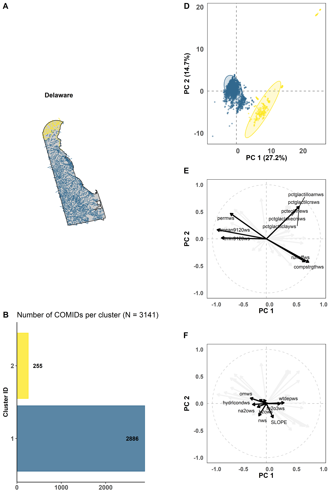
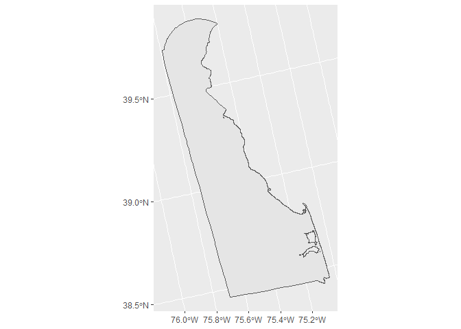

<!-- README.md is generated from README.Rmd. Please edit that file -->

# CASToolClusterPckg

<!-- badges: start -->
<!-- badges: end -->

The goal of CASToolClusterPckg is to …

## Installation

You can install the development version of CASToolClusterPckg from
[GitHub](https://github.com/) with:

``` r
# install.packages("pak")
pak::pak("laura-naslund/CASToolClusterPckg")
```

## Example

This is a basic example which shows you how to solve a common problem:

``` r
library(CASToolClusterPckg)

## Retrieve cluster data frame
de_clust_2 <- retrieve_clust_data("Delaware", 2)
head(de_clust_2)
#>     COMID ClusterID
#> 1 8074152         1
#> 2 8074186         1
#> 3 8075750         1
#> 4 8075734         1
#> 5 8075738         1
#> 6 8075744         1

## Retrieve cluster figure
de_clust_2_fig <- retrieve_clust_fig("Delaware", 2)
magick::image_read(de_clust_2_fig)
```



``` r

## Retrieve state boundary
de <- retrieve_boundary("Delaware")
ggplot2::ggplot(de)+
  ggplot2::geom_sf()
```



You’ll still need to render `README.Rmd` regularly, to keep `README.md`
up-to-date. `devtools::build_readme()` is handy for this.

In that case, don’t forget to commit and push the resulting figure
files, so they display on GitHub and CRAN.
